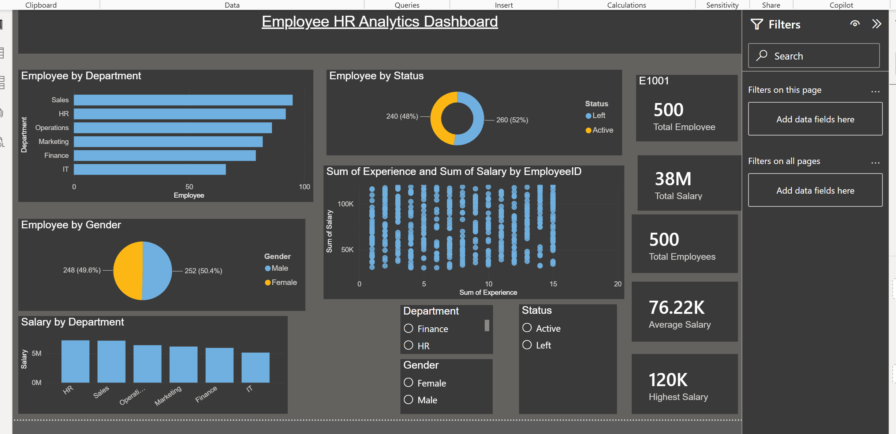

# 📊 Employee HR Analytics Dashboard

An interactive HR Analytics Dashboard developed using **Microsoft Power BI** to analyze employee performance, department-wise distribution, salary insights, and workforce demographics.

---

## 📌 Project Overview

This dashboard helps HR teams and business managers monitor employee-related KPIs and make data-driven decisions.

It provides insights into:

- Total Employees
- Employee Status
- Department-wise Employees
- Gender Distribution
- Department-wise Salary
- Experience vs Salary Analysis
- HR KPIs
- Interactive Filters

---

## 🛠 Tools Used

- Microsoft Power BI
- Microsoft Excel
- Power Query
- DAX

---

## 📷 Dashboard Preview

---

## 📊 Dashboard Features

### KPI Cards

- Total Employees
- Total Salary
- Average Salary
- Highest Salary

### Charts

- Employee by Department
- Employee by Gender
- Employee by Status
- Salary by Department
- Experience vs Salary Scatter Plot

### Filters

- Department
- Gender
- Employee Status

---

## 📂 Dataset

The dataset contains employee information including:

- Employee ID
- Department
- Gender
- Salary
- Experience
- Rating
- Status

---

## 📈 Business Insights

- HR and Sales departments have the highest number of employees.
- Gender distribution is nearly balanced.
- Salary varies significantly across departments.
- Employees with higher experience generally receive higher salaries.
- Interactive filters enable detailed workforce analysis.

---

## 📁 Project Files

- Employee_HR_Analytics.pbix
- Employee_HR_Analytics_Dataset.xlsx
- Dashboard.png
- README.md

---

## 🚀 How to Use

1. Download the repository.
2. Open the `.pbix` file in Microsoft Power BI Desktop.
3. Refresh the dataset if required.
4. Explore the dashboard using the available filters.

---

## 🎯 Skills Demonstrated

- Data Visualization
- Dashboard Design
- DAX
- Power Query
- Data Cleaning
- Business Intelligence
- KPI Reporting

---

## 👨‍💻 Author

**Jitendra Kumar Sharma**
